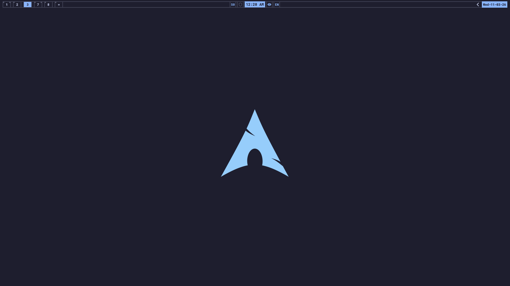

# Dotfiles

My dotfiles, managed with [GNU Stow](https://www.gnu.org/software/stow/).

## Packages

| Package | Description |
|---------|-------------|
| **hyprland** | Hyprland compositor config, hypridle, hyprpaper, layout cycling, keyboard layout notifications |
| **quickshell** | Current top bar and popup shell for Hyprland, with workspaces, tray, audio, VPN, idle inhibitor, weather, system stats, and calendar popup |
| **eww** | Legacy bar config and helper scripts still kept in-repo for migration reuse |
| **rofi** | App launcher, screenshot/screenrecord/OCR/wallpaper/emoji picker scripts |
| **waybar** | Secondary bar config and utility scripts reused by other packages |
| **dunst** | Notification daemon config |
| **sway** | Sway compositor config (legacy) |
| **tmux** | Terminal multiplexer config |

## Current State

The main bar work has moved to `quickshell`, and `eww` is now retained mostly as a source of scripts and reference modules during the migration.

The Quickshell config is modular and currently includes:

- multi-monitor bar windows
- Hyprland workspace chips, including special workspaces
- centered clock popup with quick actions, weather, and system metrics
- date-triggered calendar popup with pin support
- tray, sound, VPN, idle inhibitor, and keyboard layout indicators
- Wallust-driven colors via `wallust.js`

## Screenshots

### Hyprland

